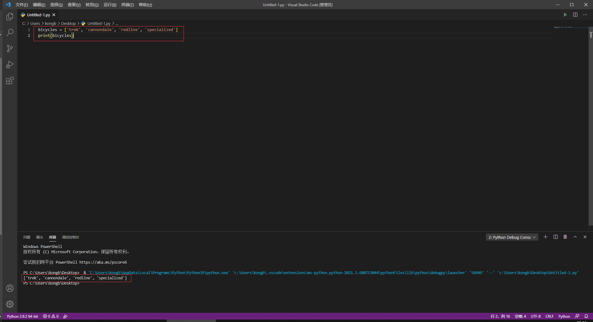
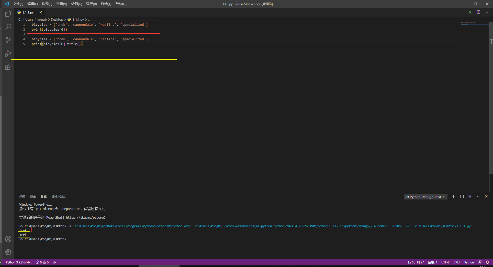
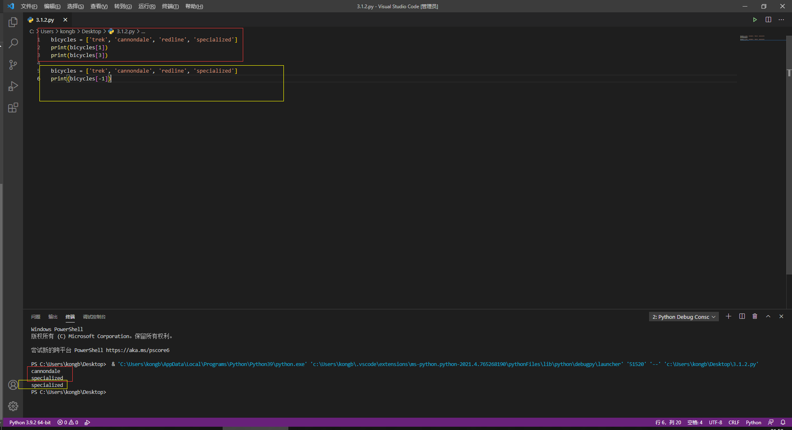
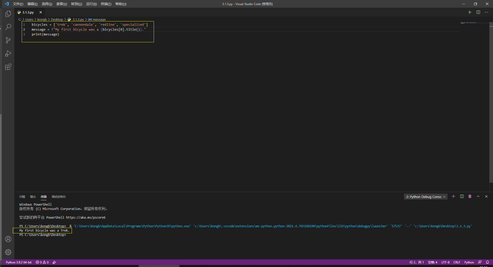

# 第三章：列表简介

# 快速导航

- [ ] **[3.1 列表是什么](https://github.com/xiaowen-king/Python/blob/main/%E7%AC%AC%E4%B8%89%E7%AB%A0%EF%BC%9A%E5%88%97%E8%A1%A8%E7%AE%80%E4%BB%8B.md#31-%E5%88%97%E8%A1%A8%E6%98%AF%E4%BB%80%E4%B9%88--)**

- [ ] **[3.1.1 访问列表元素](https://github.com/xiaowen-king/Python/blob/main/%E7%AC%AC%E4%B8%89%E7%AB%A0%EF%BC%9A%E5%88%97%E8%A1%A8%E7%AE%80%E4%BB%8B.md#311-%E8%AE%BF%E9%97%AE%E5%88%97%E8%A1%A8%E5%85%83%E7%B4%A0--)**

- [ ] **[3.1.2 索引从0而不是1开始](https://github.com/xiaowen-king/Python/blob/main/%E7%AC%AC%E4%B8%89%E7%AB%A0%EF%BC%9A%E5%88%97%E8%A1%A8%E7%AE%80%E4%BB%8B.md#312-%E7%B4%A2%E5%BC%95%E4%BB%8E0%E8%80%8C%E4%B8%8D%E6%98%AF%E4%BB%8E1%E5%BC%80%E5%A7%8B--)**

- [ ] **[3.1.3 使用列表中的各个值](https://github.com/xiaowen-king/Python/blob/main/%E7%AC%AC%E4%B8%89%E7%AB%A0%EF%BC%9A%E5%88%97%E8%A1%A8%E7%AE%80%E4%BB%8B.md#313-%E4%BD%BF%E7%94%A8%E5%88%97%E8%A1%A8%E4%B8%AD%E7%9A%84%E5%90%84%E4%B8%AA%E5%80%BC--)**

# 3.1 列表是什么 

列表由一系列按特定顺序排列的元素组成。你可以创建包含字母表中所有字母、数字0~9或所有家庭成员名字的列表；也可以将任何东西加入列表中，其中的元素之间可以没有任何关系。列表通常包含多个元素，因此给列表指定一个表示复数的名称（如letters、digits或names）是个不错的方法。

在Python中，用方括号（[]）表示列表，并用逗号分隔其中的元素。下面是一个简单的列表示例，其中包含几种自行车：

    bicycles = ['trek', 'cannondale', 'redline', 'specialized']
    print(bicycles)
    
输出结果：
    
    ['trek', 'cannondale', 'redline', 'specialized']
    
如果让Python将列表打印出来，那么Python会打印列表名等号后面的内容，包括方括号。

实操图片：

# 3.1.1 访问列表元素 

列表是有序集合，因此要访问列表的任意元素，只需将该元素的位置（**索引**）告诉Python即可。要访问列表元素，可指出列表的名称，再指出列表的索引，并将后者放在放口号内。

    bicycles = ['trek', 'cannondale', 'redline', 'specialized']
    print(bicycles[0])
    
输出结果：
    
    trek

这种访问元素的语法，当你请求获取列表元素时，Python只返回该元素，而不包括方括号

这正是你要仍用户看到的结果————整洁、干净的输出。

你还可以调用第二章介绍的字符串方法。例如，可以使用title()让元素'trek'的格式更整洁：

    bicycles = ['trek', 'cannondale', 'redline', 'specialized']
    print(bicycles[0].title())
    
输出结果：
    
    Trek
    
这个示例的输出与之前的示例输出的结果相同，只是首字母T是大写的。

实操图片：

**小结：**

**访问列表元素的方式为：**

**print(变量名[索引])**

# 3.1.2 索引从0而不是从1开始 

在Python中，第一个列表元素的索引为0，而不是1。大部分编程语言都是如此

第二个列表元素的索引为1。根据简单的计数方式，要访问列表的任何元素，都可将其位置-1，并将结果作为索引。例如你要访问第四个列表元素，可以使用索引3。

下面的代码访问索引1和索引3处的自行车

    bicycles = ['trek', 'cannondale', 'redline', 'specialized']
    print(bicycles[1])
    print(bicycles[3])

输出结果：

    cannondale
    specialized
    
可以看出这段代码最后输出的结果是列表元素中的第二个和第四个。

Python为访问最后一个列表元素提供了一种特殊的语法。通过将索引指定为-1，可让Python返回最后一个列表元素：

    bicycles = ['trek', 'cannondale', 'redline', 'specialized']
    print(bicycles[-1])
    

输出结果：

    specialized
    
这种语法很管用，因为你经常需要在不知道列表长度的情况下访问最后的元素。当索引为-2时返回的将会是倒数第二个元素，-3则为倒数第三个，以此类推。

实操图片：

**小结：**

**索引从0开始，第一个为0，第二个为1。-1为最后一个，-2为倒数第二个，依次类推**

# 3.1.3 使用列表中的各个值 

你可以像使用其他变量一样使用列表中的各个值。例如，可以使用f字符串根据列表中的值来创建消息。

下面尝试从列表中提取第一款自行车，并使用这个值创建消息：

    bicycles = ['trek', 'cannondale', 'redline', 'specialized']
    message = f"My first bicycle was a {bicycles[0].title()}."
    print(message)
    
输出结果：

    My fist bicycle was a Trek.
    
上面的代码中我们用bicycles[0]的值生成了一个句子并且赋值给了message,最后在将message打印出来。

实操图片：

**小结：**
**可以使用f字符串根据列表中的值来创建消息**
