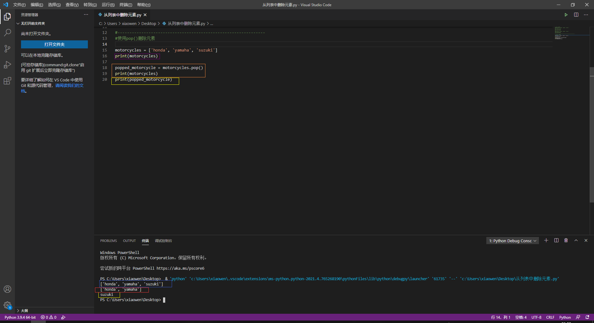
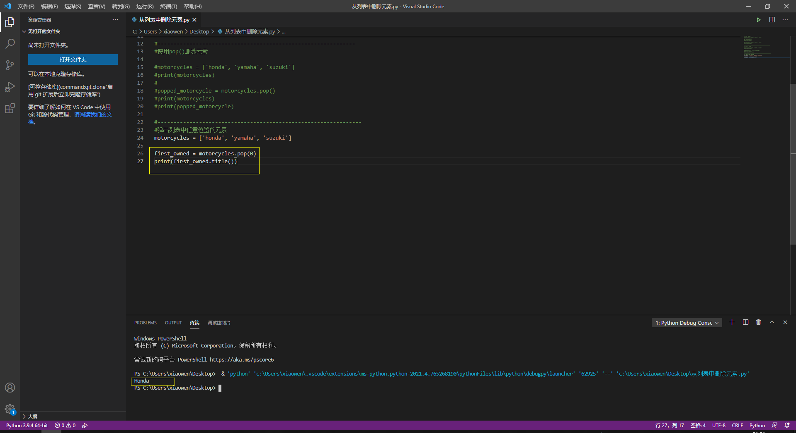
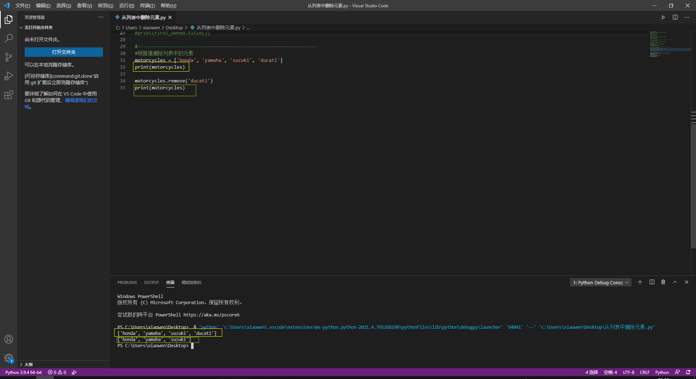
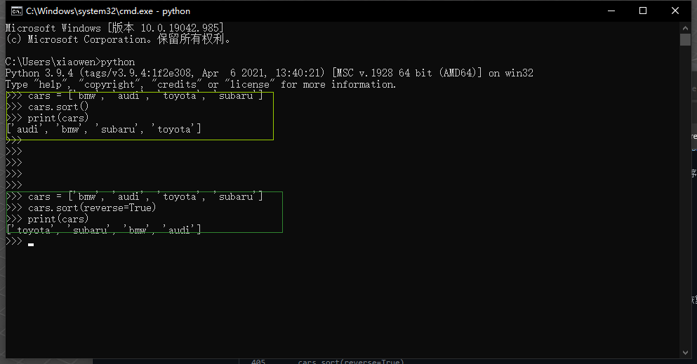

# 第三章：列表简介

# 快速导航

- [x] **[3.1 列表是什么](https://github.com/xiaowen-king/Python/blob/main/%E7%AC%AC%E4%B8%89%E7%AB%A0%EF%BC%9A%E5%88%97%E8%A1%A8%E7%AE%80%E4%BB%8B.md#31-%E5%88%97%E8%A1%A8%E6%98%AF%E4%BB%80%E4%B9%88--)**

- [x] **[3.1.1 访问列表元素](https://github.com/xiaowen-king/Python/blob/main/%E7%AC%AC%E4%B8%89%E7%AB%A0%EF%BC%9A%E5%88%97%E8%A1%A8%E7%AE%80%E4%BB%8B.md#311-%E8%AE%BF%E9%97%AE%E5%88%97%E8%A1%A8%E5%85%83%E7%B4%A0--)**

- [x] **[3.1.2 索引从0而不是1开始](https://github.com/xiaowen-king/Python/blob/main/%E7%AC%AC%E4%B8%89%E7%AB%A0%EF%BC%9A%E5%88%97%E8%A1%A8%E7%AE%80%E4%BB%8B.md#312-%E7%B4%A2%E5%BC%95%E4%BB%8E0%E8%80%8C%E4%B8%8D%E6%98%AF%E4%BB%8E1%E5%BC%80%E5%A7%8B--)**

- [x] **[3.1.3 使用列表中的各个值](https://github.com/xiaowen-king/Python/blob/main/%E7%AC%AC%E4%B8%89%E7%AB%A0%EF%BC%9A%E5%88%97%E8%A1%A8%E7%AE%80%E4%BB%8B.md#313-%E4%BD%BF%E7%94%A8%E5%88%97%E8%A1%A8%E4%B8%AD%E7%9A%84%E5%90%84%E4%B8%AA%E5%80%BC--)**

- [x] **[3.2 修改、添加和删除元素](https://github.com/xiaowen-king/Python/blob/main/%E7%AC%AC%E4%B8%89%E7%AB%A0%EF%BC%9A%E5%88%97%E8%A1%A8%E7%AE%80%E4%BB%8B.md#32-%E4%BF%AE%E6%94%B9%E6%B7%BB%E5%8A%A0%E5%92%8C%E5%88%A0%E9%99%A4%E5%85%83%E7%B4%A0--)**

- [x] **[3.2.1 修改列表元素](https://github.com/xiaowen-king/Python/blob/main/%E7%AC%AC%E4%B8%89%E7%AB%A0%EF%BC%9A%E5%88%97%E8%A1%A8%E7%AE%80%E4%BB%8B.md#321-%E4%BF%AE%E6%94%B9%E5%88%97%E8%A1%A8%E5%85%83%E7%B4%A0--)**

- [x] **[3.2.2 在列表中添加元素](https://github.com/xiaowen-king/Python/blob/main/%E7%AC%AC%E4%B8%89%E7%AB%A0%EF%BC%9A%E5%88%97%E8%A1%A8%E7%AE%80%E4%BB%8B.md#322-%E5%9C%A8%E5%88%97%E8%A1%A8%E4%B8%AD%E6%B7%BB%E5%8A%A0%E5%85%83%E7%B4%A0--)**

- [x] **[3.2.3 从列表中删除元素](https://github.com/xiaowen-king/Python/blob/main/%E7%AC%AC%E4%B8%89%E7%AB%A0%EF%BC%9A%E5%88%97%E8%A1%A8%E7%AE%80%E4%BB%8B.md#323-%E4%BB%8E%E5%88%97%E8%A1%A8%E4%B8%AD%E5%88%A0%E9%99%A4%E5%85%83%E7%B4%A0--)**

- [x] **[3.3 组织列表](https://github.com/xiaowen-king/Python/blob/main/%E7%AC%AC%E4%B8%89%E7%AB%A0%EF%BC%9A%E5%88%97%E8%A1%A8%E7%AE%80%E4%BB%8B.md#33-%E7%BB%84%E7%BB%87%E5%88%97%E8%A1%A8--)**

- [x] **[3.3.1 使用方法sort()对列表永久排序](https://github.com/xiaowen-king/Python/blob/main/%E7%AC%AC%E4%B8%89%E7%AB%A0%EF%BC%9A%E5%88%97%E8%A1%A8%E7%AE%80%E4%BB%8B.md#331-%E4%BD%BF%E7%94%A8%E6%96%B9%E6%B3%95sort%E5%AF%B9%E5%88%97%E8%A1%A8%E6%B0%B8%E4%B9%85%E6%8E%92%E5%BA%8F--)**

# 3.1 列表是什么 

列表由一系列按特定顺序排列的元素组成。你可以创建包含字母表中所有字母、数字0~9或所有家庭成员名字的列表；也可以将任何东西加入列表中，其中的元素之间可以没有任何关系。列表通常包含多个元素，因此给列表指定一个表示复数的名称（如letters、digits或names）是个不错的方法。

在Python中，用方括号（[]）表示列表，并用逗号分隔其中的元素。下面是一个简单的列表示例，其中包含几种自行车：

    bicycles = ['trek', 'cannondale', 'redline', 'specialized']
    print(bicycles)
    
输出结果：
    
    ['trek', 'cannondale', 'redline', 'specialized']
    
如果让Python将列表打印出来，那么Python会打印列表名等号后面的内容，包括方括号。

实操图片：

# 3.1.1 访问列表元素 

列表是有序集合，因此要访问列表的任意元素，只需将该元素的位置（**索引**）告诉Python即可。要访问列表元素，可指出列表的名称，再指出列表的索引，并将后者放在放口号内。

    bicycles = ['trek', 'cannondale', 'redline', 'specialized']
    print(bicycles[0])
    
输出结果：
    
    trek

这种访问元素的语法，当你请求获取列表元素时，Python只返回该元素，而不包括方括号

这正是你要仍用户看到的结果————整洁、干净的输出。

你还可以调用第二章介绍的字符串方法。例如，可以使用title()让元素'trek'的格式更整洁：

    bicycles = ['trek', 'cannondale', 'redline', 'specialized']
    print(bicycles[0].title())
    
输出结果：
    
    Trek
    
这个示例的输出与之前的示例输出的结果相同，只是首字母T是大写的。

实操图片：

**小结：**

**访问列表元素的方式为：**

**print(变量名[索引])**

源码下载：[点击下载](https://github.com/xiaowen-king/Python/raw/main/%E6%BA%90%E7%A0%81%E5%AD%98%E6%94%BE/%E7%AC%AC%E4%B8%89%E7%AB%A0%E6%BA%90%E7%A0%81/3.1.1.zip)

# 3.1.2 索引从0而不是从1开始 

在Python中，第一个列表元素的索引为0，而不是1。大部分编程语言都是如此

第二个列表元素的索引为1。根据简单的计数方式，要访问列表的任何元素，都可将其位置-1，并将结果作为索引。例如你要访问第四个列表元素，可以使用索引3。

下面的代码访问索引1和索引3处的自行车

    bicycles = ['trek', 'cannondale', 'redline', 'specialized']
    print(bicycles[1])
    print(bicycles[3])

输出结果：

    cannondale
    specialized
    
可以看出这段代码最后输出的结果是列表元素中的第二个和第四个。

Python为访问最后一个列表元素提供了一种特殊的语法。通过将索引指定为-1，可让Python返回最后一个列表元素：

    bicycles = ['trek', 'cannondale', 'redline', 'specialized']
    print(bicycles[-1])
    

输出结果：

    specialized
    
这种语法很管用，因为你经常需要在不知道列表长度的情况下访问最后的元素。当索引为-2时返回的将会是倒数第二个元素，-3则为倒数第三个，以此类推。

实操图片：

**小结：**

**索引从0开始，第一个为0，第二个为1。-1为最后一个，-2为倒数第二个，依次类推**

源码下载：[点击下载](https://github.com/xiaowen-king/Python/raw/main/%E6%BA%90%E7%A0%81%E5%AD%98%E6%94%BE/%E7%AC%AC%E4%B8%89%E7%AB%A0%E6%BA%90%E7%A0%81/3.1.2.zip)

# 3.1.3 使用列表中的各个值 

你可以像使用其他变量一样使用列表中的各个值。例如，可以使用f字符串根据列表中的值来创建消息。

下面尝试从列表中提取第一款自行车，并使用这个值创建消息：

    bicycles = ['trek', 'cannondale', 'redline', 'specialized']
    message = f"My first bicycle was a {bicycles[0].title()}."
    print(message)
    
输出结果：

    My fist bicycle was a Trek.
    
上面的代码中我们用bicycles[0]的值生成了一个句子并且赋值给了message,最后在将message打印出来。

实操图片：

**小结：**

**可以使用f字符串根据列表中的值来创建消息**

源码下载：[点击下载](https://github.com/xiaowen-king/Python/raw/main/%E6%BA%90%E7%A0%81%E5%AD%98%E6%94%BE/%E7%AC%AC%E4%B8%89%E7%AB%A0%E6%BA%90%E7%A0%81/3.1.3.zip)

# 3.2 修改、添加和删除元素 

你创建的大多数列表将是动态的，这意味着列表创建后，将随着程序的运行增删元素。例如，你创建一个游戏，要求玩家射杀从天而降的外星人。为此，可在开始时将一些外星人存储在列表中，然后每当外星人被射杀时，都将其从列表中删除，而每次有新的外星人出现在屏幕上时，都将其添加到列表中。在整个游戏运行期间，外星人列表的长度将不断变化。

# 3.2.1 修改列表元素 

修改列表元素的语法与访问列表元素的语法类似。要修改列表元素，可指定列表名和要修改的元素的索引，在指定该元素的新值。

下列有一个摩托车列表，我们需要修改其中的第一个元素‘honda’

    motorcyles = ['honda', 'yamaha', 'suzuki']
    print(motorcyles)
    
    motorcyles[0] = 'ducati'
    print(motorcyles)
    
第二行代码输出结果：

    ['honda', 'yamaha', 'suzuki']
    
第四行代码输出结果：
    
    ['ducati', 'yamaha', 'suzuki']

首先定义一个摩托车列表，其中第一个元素为‘honda’,其中第三行代码将这个列表的第一个元素修改为了'ducati'。

你可以修改任意列表中的任意元素，而不仅仅是第一个元素的值。

实操图片：

**小结**

**修改列表元素的方式为：**

**列表名[要修改的元素索引] = '修改后的值'**

源码下载：[点击下载](https://github.com/xiaowen-king/Python/raw/main/%E6%BA%90%E7%A0%81%E5%AD%98%E6%94%BE/%E7%AC%AC%E4%B8%89%E7%AB%A0%E6%BA%90%E7%A0%81/3.2.1.zip)

# 3.2.2 在列表中添加元素 

你可能处于各种原因要在列表中添加新元素。例如，你可能希望游戏中出现新的外星人、添加可视化数据或给网站添加新注册的用户。Python提供了多种在既有列表中添加新数据的方式。

**1.在列表末尾添加元素**

在列表中添加新元素时，最简单的方式是将元素附加到列表。给列表附加元素时，它将添加到末尾。继续使用前一个示例中的列表，在其末尾添加新元素'ducati'

    motorcycles = ['honda', 'yamaha', 'suzuki']
    print(motorcycles)
    
    motorcycles.append('ducati')
    print(motorcycles)
    
第二行代码输出结果：

    ['honda', 'yamaha', 'suzuki']
    
第四行代码输出结果：

    ['honda', 'yamaha', 'suzuki', 'ducati']
    
第三行代码中使用了'append()'将元素'ducati'附加到了列表motorcyles末尾，而不影响列表中的其他所有元素。

方法append()让动态的创建列表易如反掌。例如，你可以先创建一个空列表，在使用一系列函数调用append()来添加元素。下面来创建一个空列表，再在其中添加元素'honda'、'yamaha'和'suzuki':

    motorcycles = []
    
    motorcycles.append('honda')
    motorcycles.append('yamaha')
    motorcycles.append('suzuki')
    
    print(motorcycles)
    
最后输出结果：

    ['honda', 'yamaha', 'suzuki']
    
这种创建列表的方式及其常见，因为经常要等程序运行后，你才能知道用户要在程序中存储哪些数据。为控制用户，可以先创建一个空列表，用于存储用户将要输入的值，然后将用户提供的每个新值附加到列表中。

实操图片：

**2.在列表中插入元素**

使用方法insert()可在列表的任何位置添加新元素。为此，你需要指定新元素的索引和值。

    motorcycles = ['honda', 'yamaha', 'suzuke']
    
    motorcycles.insert(0, 'ducati')
    print(motorcycles)
    
最后输出结果为：

    ['ducati', 'honda', 'yamaha', 'suzuke']
    
在这个示例中，ducati被插入到了列表开头，方法insert()需要指定两个参数，第一个参数为索引，也就是你需要插入到列表的什么位置，第二个参数为要插入的值。

实操图片：

**小结：**

**在列表末尾添加元素用方法append()，使用方式为：列表名.append('要添加的值')**

**在列表中插入元素用方法insert()，这个函数需要添加两个参数在括号内，两个参数中间用逗号隔开，第一个参数为索引，也就是你需要将元素插入到列表中的什么位置，第二个参数为要插入的值，使用方式为：列表名.insert(索引, '要插入的值')**

源码下载：[点击下载](https://github.com/xiaowen-king/Python/raw/main/%E6%BA%90%E7%A0%81%E5%AD%98%E6%94%BE/%E7%AC%AC%E4%B8%89%E7%AB%A0%E6%BA%90%E7%A0%81/3.2.2.zip)

# 3.2.3 从列表中删除元素 

你经常需要从列表中删除一个或多个元素。例如，玩家将空中的一个外星人射杀后，你很可能要将其从存活的外星人列表中删除等。

**1.使用del语句删除元素**

如果知道要删除的元素在列表中的位置，可使用del语句。

    motorcycles = ['honda', 'yamaha', 'suzuki']
    print(motorcycles)
    
    del motorcycles[0]
    print(motorcycles)
    
第二行代码输出结果为：

    ['honda', 'yamaha', 'suzuki']
    
第四行代码输出结果为：

    ['yamaha', 'suzuki']
    
第二行代码中使用了del删除了列表motorcycles中的第一个元素‘honda’:

使用del可删除任意位置处的列表元素，条件是知道其索引。例如，要删除的列表中的yamaha元素，知道了这个元素在列表中的索引为1，代码为：

    del motorcycles[1]
    
实操图片：

**2.使用方法pop()删除元素**

有时候，你要将元素从列表中删除，并接着使用它的值。例如，你可能需要获取刚被射杀的外星人的x坐标和y坐标，以便在相应的位置显示爆炸效果；在web应用程序中，你可能要将用户从活跃的成员列表中删除，并将其加入到非活跃的成员列表中。

方法pop()删除元素列表末尾的元素，并让你能够接着使用它。术语弹出(pop)源自这样的类比：列表就像一个栈，而删除列表末尾的元素相当于弹出栈顶元素。

下面从列表motorcycles中弹出一款摩托车：

    motorcycles = ['honda', 'yamaha', 'suzuki']
    print(motorcycles)
    
    popped_motorcycle = motorcycles.pop()
    print(motorcycles)
    print(popped_motorcycle)
    
第二行的代码输出结果为：
    
    ['honda', 'yamaha', 'suzuki']
    
第四行的代码输出结果为：

    ['honda', 'yamaha',]
    
第五行的代码输出结果为：

    suzuki
    
第一行代码我们创建了一个列表，第二行代码完整的输出了这个列表，第三行代码我们弹出了最后一个元素并且赋值给了变量poped_motorcycle，第四行代码输出了弹出值后的列表，第五行代码显示了弹出去的值

实操图片：

**3.弹出列表中任何位置处的元素**

实际上，可以使用pop()来删除列表中任意位置的元素，只需要圆括号中指定要删除元素的索引即可。

    motorcycles = ['honda', 'yamaha', 'suzuki']
    
    first_owned = motorcycles.pop(0)
    print(first_owned.title())
    
最后的输出结果为：

    Honda
    
使用pop()弹出的元素将不会再列表中。

如果你不确定该使用del语句还是pop()方法，下面是一个简单的判断标准：如果你需要从列表中删除一个元素，且不在以任何方式使用它，就可以使用del语句；如果你要在删除元素后还能继续使用它，就使用方法pop()。

实操图片：

**4.根据值删除元素**

有时候，你不知道要从列表中删除的元素所在的位置，如果值知道要删除的元素的值，可以使用方法remove()

例如，假设要从列表motorcycles中删除元素'ducati'.

    motorcycles = ['honda', 'yamaha', 'suzuki', 'ducati']
    print(motorcycles)
    
    motorcycles.remove('ducati')
    print(motorcycles)
    
第二行的输出结果为：

    ['honda', 'yamaha', 'suzuki', 'ducati']
    
第四行的代码输出结果为：

    ['honda', 'yamaha', 'suzuki']

第三行代码确定了ducati元素在什么位置并删除了它

实操图片：

**小结：**

**del语句的使用方法：del 变量名/列表名[索引]**

**pop的使用方法1：变量名2 = 变量名/列表名.pop()**

**pop的使用方法2：变量名2 = 变量名/列表名.pop(索引)**

**方法1默认弹出列表末尾的元素，方法二为弹出你指定的元素**

**remove()的使用方法：变量名.remover('元素')**

**方法remove()只删除第一个指定的值，如果要删除的值在列表中存在多个，则需要使用循环来确保将每一个值都删除。**

源码下载：[点击下载](https://github.com/xiaowen-king/Python/raw/main/%E6%BA%90%E7%A0%81%E5%AD%98%E6%94%BE/%E7%AC%AC%E4%B8%89%E7%AB%A0%E6%BA%90%E7%A0%81/3.2.3.zip)

# 3.3 组织列表 

在你创建列表中，元素的排列顺序常常是无法预测的，因为你并非总能控制用户提供的数据的顺序。这虽然在大多数情况下是不可避免的，但你经常需要以特定的顺序呈现信息。有时候，你希望保留列表元素最初的排列顺序，而有时候又需要调整排列顺序。Python提供了很多组织列表的方式，可根据具体情况选用。

# 3.3.1 使用方法sort()对列表永久排序 

Python方法sotr()让你能够较为轻松的对列表进行排序。假设你有一个汽车列表，并要让其中的汽车按字母顺序排列。为简化这项任务，假设该列表中的所有值都是小写的。

    cars = ['bmw', 'audi', 'toyota', 'subaru']
    cars.sort()
    print(cars)
    
最后输出结果为：

    ['audi', 'bmw', 'subaru', 'toyota']
    
在第二行代码中，方法sort()永久性的修改列表元素的排列顺序。现在，汽车是按字母顺序排列的，在也无法恢复到原来的排列顺序：

还可以按字母顺序的相反顺序排列列表元素，只需要向sort()方法传递参数 reverse=True 即可。

    cars = ['bmw', 'audi', 'toyota', 'subaru']
    cars.sort(reverse=True)
    print(cars)
    
最后输出结果为：
    
    ['toyota', 'subaru', 'bmw', 'audi']
    
同样，对列表元素排列的修改是永久性的。

实操图片：

**小结：**

**sort()使用方法为：变量名/列表名.sort()**

**sort()不带参数为按字母正序排序**

**sort()在圆括号内带 reverse=True 则为按字母倒序排序**

源码下载：[点击下载](https://github.com/xiaowen-king/Python/raw/main/%E6%BA%90%E7%A0%81%E5%AD%98%E6%94%BE/%E7%AC%AC%E4%B8%89%E7%AB%A0%E6%BA%90%E7%A0%81/3.3.1.zip)

# 3.3.2 使用函数sorted()对列表临时排序 

要保留列表元素原来的排列顺序，同时以特定的顺序呈现它们，可使用函数sorted()。函数sorted()让你能够按特定顺序显示列表元素，同时不影响它们在列表中的原始排列顺序。

    cars = ['bmw', 'audi', 'toyota', 'subaru']
    
    print(cars)
    
    print(sorted(cars))
    
    print(cars)
    
第二行代码输出结果为：

    ['bmw', 'audi', 'toyota', 'subaru']
    
第三行代码输出结果为：

    ['audi', 'bmw', 'subaru', 'toyota']
    
第四行代码输出结果为：

    ['bmw', 'audi', 'toyota', 'subaru']
    
第二行代码输出的是原始的列表，第三行代码使用了函数sorted()函数，所以输出的列表排列顺序改为了按字母顺序排列，最后一行代码没有使用sorted()函数，所以输出的结果还是原始列表的排序方式。

使用sorted()并不会改变列表的排列顺序，sorted()函数默认的是按字母正序排列。

实操图片：

如果想要倒着排列可以在sorted()函数后面添加“reverse=True”这个函数。

    cars = ['bmw', 'audi', 'toyota', 'subaru']
    
    print(sorted(cars,reverse=True))
    
最后的输出结果为：

    ['toyota', 'subaru', 'bmw', 'audi']
    
实操图片：

**小结：**

**sorted()使用方法为：print(sorted(变量名/列表名)),默认情况为按字母正序排列，需要按字母倒序排列为：print(sorted(变量名/列表名,reverse=True))**

源码下载：[点击下载](https://github.com/xiaowen-king/Python/raw/main/%E6%BA%90%E7%A0%81%E5%AD%98%E6%94%BE/%E7%AC%AC%E4%B8%89%E7%AB%A0%E6%BA%90%E7%A0%81/3.3.2.zip)
