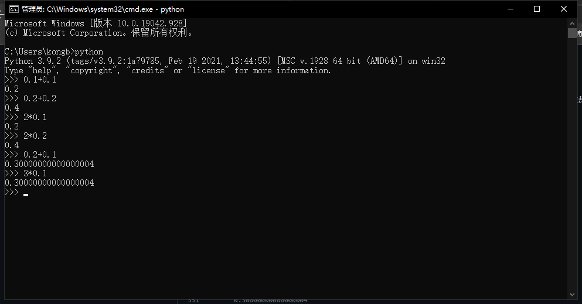
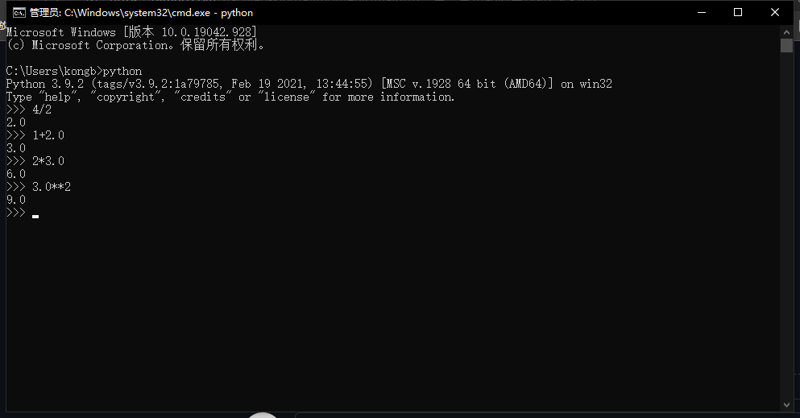
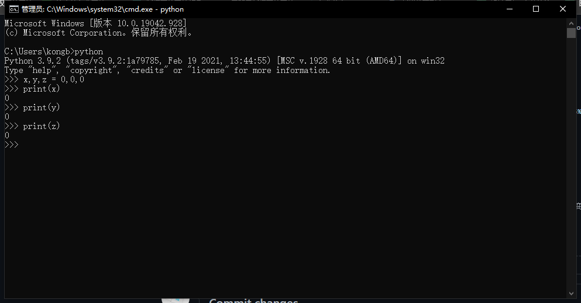

# 第二章：变量和简单数据类型

# 快速导航

- [ ] **[2.1变量](https://github.com/xiaowen-king/Python/blob/main/%E7%AC%AC%E4%BA%8C%E7%AB%A0%EF%BC%9A%E5%8F%98%E9%87%8F%E5%92%8C%E7%AE%80%E5%8D%95%E6%95%B0%E6%8D%AE%E7%B1%BB%E5%9E%8B.md#21%E5%8F%98%E9%87%8F--)**

- [ ] **[2.1.1变量的命名和使用](https://github.com/xiaowen-king/Python/blob/main/%E7%AC%AC%E4%BA%8C%E7%AB%A0%EF%BC%9A%E5%8F%98%E9%87%8F%E5%92%8C%E7%AE%80%E5%8D%95%E6%95%B0%E6%8D%AE%E7%B1%BB%E5%9E%8B.md#211%E5%8F%98%E9%87%8F%E7%9A%84%E5%91%BD%E5%90%8D%E5%92%8C%E4%BD%BF%E7%94%A8--)**

- [ ] **[2.1.2使用变量时避免命名错误](https://github.com/xiaowen-king/Python/blob/main/%E7%AC%AC%E4%BA%8C%E7%AB%A0%EF%BC%9A%E5%8F%98%E9%87%8F%E5%92%8C%E7%AE%80%E5%8D%95%E6%95%B0%E6%8D%AE%E7%B1%BB%E5%9E%8B.md#212-%E4%BD%BF%E7%94%A8%E5%8F%98%E9%87%8F%E6%97%B6%E9%81%BF%E5%85%8D%E5%91%BD%E5%90%8D%E9%94%99%E8%AF%AF--)**

- [ ] **[2.1.3变量是标签](https://github.com/xiaowen-king/Python/blob/main/%E7%AC%AC%E4%BA%8C%E7%AB%A0%EF%BC%9A%E5%8F%98%E9%87%8F%E5%92%8C%E7%AE%80%E5%8D%95%E6%95%B0%E6%8D%AE%E7%B1%BB%E5%9E%8B.md#213%E5%8F%98%E9%87%8F%E6%98%AF%E6%A0%87%E7%AD%BE--)**

- [ ] **[练习](https://github.com/xiaowen-king/Python/blob/main/%E7%AC%AC%E4%BA%8C%E7%AB%A0%EF%BC%9A%E5%8F%98%E9%87%8F%E5%92%8C%E7%AE%80%E5%8D%95%E6%95%B0%E6%8D%AE%E7%B1%BB%E5%9E%8B.md#%E7%BB%83%E4%B9%A0--)**

- [ ] **[2.2字符串](https://github.com/xiaowen-king/Python/blob/main/%E7%AC%AC%E4%BA%8C%E7%AB%A0%EF%BC%9A%E5%8F%98%E9%87%8F%E5%92%8C%E7%AE%80%E5%8D%95%E6%95%B0%E6%8D%AE%E7%B1%BB%E5%9E%8B.md#22-%E5%AD%97%E7%AC%A6%E4%B8%B2--)**

- [ ] **[2.2.1使用方法修改字符串的大小写](https://github.com/xiaowen-king/Python/blob/main/%E7%AC%AC%E4%BA%8C%E7%AB%A0%EF%BC%9A%E5%8F%98%E9%87%8F%E5%92%8C%E7%AE%80%E5%8D%95%E6%95%B0%E6%8D%AE%E7%B1%BB%E5%9E%8B.md#221-%E4%BD%BF%E7%94%A8%E6%96%B9%E6%B3%95%E4%BF%AE%E6%94%B9%E5%AD%97%E7%AC%A6%E4%B8%B2%E7%9A%84%E5%A4%A7%E5%B0%8F%E5%86%99--)**

- [ ] **[2.2.2在字符串中使用变量](https://github.com/xiaowen-king/Python/blob/main/%E7%AC%AC%E4%BA%8C%E7%AB%A0%EF%BC%9A%E5%8F%98%E9%87%8F%E5%92%8C%E7%AE%80%E5%8D%95%E6%95%B0%E6%8D%AE%E7%B1%BB%E5%9E%8B.md#222-%E5%9C%A8%E5%AD%97%E7%AC%A6%E4%B8%B2%E4%B8%AD%E4%BD%BF%E7%94%A8%E5%8F%98%E9%87%8F--)**

- [ ] **[2.2.3使用制表符或换行符来添加空白](https://github.com/xiaowen-king/Python/blob/main/%E7%AC%AC%E4%BA%8C%E7%AB%A0%EF%BC%9A%E5%8F%98%E9%87%8F%E5%92%8C%E7%AE%80%E5%8D%95%E6%95%B0%E6%8D%AE%E7%B1%BB%E5%9E%8B.md#223%E4%BD%BF%E7%94%A8%E5%88%B6%E8%A1%A8%E7%AC%A6%E6%88%96%E6%8D%A2%E8%A1%8C%E7%AC%A6%E6%9D%A5%E6%B7%BB%E5%8A%A0%E7%A9%BA%E7%99%BD--)**

- [ ] **[2.2.4 删除空白](https://github.com/xiaowen-king/Python/blob/main/%E7%AC%AC%E4%BA%8C%E7%AB%A0%EF%BC%9A%E5%8F%98%E9%87%8F%E5%92%8C%E7%AE%80%E5%8D%95%E6%95%B0%E6%8D%AE%E7%B1%BB%E5%9E%8B.md#224-%E5%88%A0%E9%99%A4%E7%A9%BA%E7%99%BD--)**

- [ ] **[2.3 数](https://github.com/xiaowen-king/Python/blob/main/%E7%AC%AC%E4%BA%8C%E7%AB%A0%EF%BC%9A%E5%8F%98%E9%87%8F%E5%92%8C%E7%AE%80%E5%8D%95%E6%95%B0%E6%8D%AE%E7%B1%BB%E5%9E%8B.md#23-%E6%95%B0--)**

- [ ] **[2.3.1 整数](https://github.com/xiaowen-king/Python/blob/main/%E7%AC%AC%E4%BA%8C%E7%AB%A0%EF%BC%9A%E5%8F%98%E9%87%8F%E5%92%8C%E7%AE%80%E5%8D%95%E6%95%B0%E6%8D%AE%E7%B1%BB%E5%9E%8B.md#231-%E6%95%B4%E6%95%B0--)**

- [ ] **[2.3.2 浮点数](https://github.com/xiaowen-king/Python/blob/main/%E7%AC%AC%E4%BA%8C%E7%AB%A0%EF%BC%9A%E5%8F%98%E9%87%8F%E5%92%8C%E7%AE%80%E5%8D%95%E6%95%B0%E6%8D%AE%E7%B1%BB%E5%9E%8B.md#232-%E6%B5%AE%E7%82%B9%E6%95%B0--)**

- [ ] **[2.3.3 整数和浮点数](https://github.com/xiaowen-king/Python/blob/main/%E7%AC%AC%E4%BA%8C%E7%AB%A0%EF%BC%9A%E5%8F%98%E9%87%8F%E5%92%8C%E7%AE%80%E5%8D%95%E6%95%B0%E6%8D%AE%E7%B1%BB%E5%9E%8B.md#233-%E6%95%B4%E6%95%B0%E5%92%8C%E6%B5%AE%E7%82%B9%E6%95%B0--)**

## 2.1变量 

创建一个名字为“Hello Python world.py”的Python文件，在文件里面添加一下代码：

      message = "Hello Python world"
      
      print(message)

运行这个小程序的时候得到的输出结果为：

      Hello Python world
      
在这个小程序中，第一行代码的“message”就是变量名，等号后面的“Hello Python world”为值，中间的等号代表赋值，整句代码的意思为：将“Hello Python world”赋值给“message”

**实操图片：**

## 2.1.1变量的命名和使用 

- [ ] 变量名只能包含字母、数字、下划线。变量名能以字母或下划线开头，但是不能以数字开头。例如，可将变量命名为message_1，但是不能将它命名为1_message。

- [ ] 变量名不能包含空格，但是可以使用下划线代替空格。例如，变量名 greeting_message可以使用，但是变量名greeting message会引发错误。

- [ ] 不要将Python关键字和函数名用作变量名，就是不要使用Python保留用于特色用途的单词，例如：

**Python关键字**

False | await | else | import | pass
----- | ----- | ---- | ------ | ----
None | break | exvept | in | raise
True | class | finally | is | return
and | continue | for | lambda | try
as | def | from | nonlocal | while
assert | del | global | not | with
async | elif | if | or | yield

**Python内置函数**

ads() | delattr() | hash() | memoryview() | set
----- | --------- | ------ | ------------ | ---
all() | dict() | help() | min() | setattr()
any() | dir() | hex() | next() | slice()
ascii() | divmod() | id() | object() | sorted()
bin() | enumerate() | input() | oct() | staticmethod()
bool() | eval() | int() | open() | str()
breakpoint() | exec() | isinstance() | ord() | sum()
bytearray() | filter() | issubclass() | pow() | super()
bytes() | float() | iter() | print() | tuple()
callable() | format() | len() | property() | type()
chr() | frozenset() | list() | range() | vars()
classmethod() | getattr() | locals() | repr() | zip()
compile() | globals() | map() | reversed() | import()
complex() | hasattr() | max() | round()

- [ ] 变量名应即简短又具有描述性。例如，name比n好，student_name比s_n好，name_length比length_of_persons_name好。

- [ ] 慎用小写字母l和大写字母O，因为它们可能被人看错成数字1和0。

## 2.1.2 使用变量时避免命名错误 

每个程序员都会犯错，而且大多数程序员每天都会犯错，但是我们犯错之后要学会如何解决

下面这段代码时特意编写错误的，看看如何快速的找出错误的地方

      message = "Hello Python Crash Course reader!"
      print(mesage)
      
运行之后的输出结果为：

      Traceback (most recent call last):
            File "c:\Users\kongb\Desktop\hello_world.py", line 2, in <module>
            print(mesage)
      NameError: name 'mesage' is not defined
      
重点时最后一句“NameError: name 'mesage' is not defined”，这个地方Python已经帮你找出了错误，这上面显示的错误信息的意思为：打印的名称mesage未定义。简单的说就是找不到mesage这个变量

**实操图片：**

## 2.1.3变量是标签 

变量常被描述为可用于存储值的盒子。在刚刚接触变量的时候，这种定义可能很有帮助，但是它并没有准确的描述Python内部表示的方式。另一种更好的定义是，变量是可以赋给值的标签，也可以说变量指向特定的值。

## 练习 

### 练习1——简单消息

将一条消息赋值给变量，并且将其打印出来。

      news = "你好！"
      print(news)

输出结果：你好！

**实操图片：**

源码下载：
[点击下载](https://github.com/xiaowen-king/Python/raw/main/%E6%BA%90%E7%A0%81%E5%AD%98%E6%94%BE/%E7%AC%AC%E4%BA%8C%E7%AB%A0%E6%BA%90%E7%A0%81/%E7%AE%80%E5%8D%95%E6%B6%88%E6%81%AF.zip)

### 练习2——多条简单信息

将一条消息赋给变量，并将其打印出来；再将变量的值修改为一条新消息，并将其打印出来。

      news = "你好！"
      print(news)
      
      news = "Hello!"
      print(news)
      
输出结果为：

你好！

Hello!

**实操图片：**

源码下载：
[点击下载](https://github.com/xiaowen-king/Python/raw/main/%E6%BA%90%E7%A0%81%E5%AD%98%E6%94%BE/%E7%AC%AC%E4%BA%8C%E7%AB%A0%E6%BA%90%E7%A0%81/%E5%A4%9A%E6%9D%A1%E7%AE%80%E5%8D%95%E6%B6%88%E6%81%AF.zip)

# 2.2 字符串 

字符串就是一系列字符。在Python中，用引号括起来的都是字符串，其中引号可以双引号也可以是单引号，但前提是半圆角的，也就是我们长说的英文状态下的引号。

# 2.2.1 使用方法修改字符串的大小写 

对于字符串，可执行的最简单的操作之一就是修改其中单词的大小写。请看下面代码，并判断其作用：

      name = "ada lovelace"
      print(name.title())
      
输出结果：

      Ada Lovelace
      
在上面代码中，name指向的是小写的“ada lovelace”，在函数调用print()中，方法title()出现在这个变量后面，方法是python可对数据执行操作。在name.title()中，name后面的句号（.）让python对变量name执行方法title()指定的操作。每个方法后面都跟着一对圆括号，这是因为方法通常需要额外的信息来完成其工作。这种信息在圆括号内提供的。函数title()不需要额外的信息，因此他后面的圆括号是空的。

修改字符串大小写函数：

全小写 | 全大写 | 首字母大写
------ | ----- | ---------
lower() | upper() | title()

使用上面三个函数即可对字符串进行大小写操作，使用方法和上诉使用方法一样。

使用方法修改字符串大小写图片：

# 2.2.2 在字符串中使用变量 

在有些情况下，你可能想要在字符串中使用变量，例如，你可能想使用两个变量分别表示名和姓，然后合并这两个值以显示姓名：

      first_name = "ada"
      last_name = "lovelace"
      full_name = f"{first_name} {last_name}"
      print(full_name)
      
输出结果为：

      ada lovelace

要在字符串中插入变量的值，可以在前引号前加入加上字母f，就像上面那段代码一样，在将要插入的变量方在花括号内，这样，Python显示字符串时，将把每个变量都替换为其值。

f可以用来插入两个或者多个变量的值，也可以用来在字符串中插入变量的值，例如：

      frist_name = "ada"
      last_name = "lovelace"
      print(f"hello {frist_name} {last_name}")
      
输出结果为：

      hello ada lovelace
      
**总结：**f可以用来连接多个变量的值，也可以用来连接字符串和变量的值

**注意：**f字符串时Python 3.6引入的，如果你的Python是3.5或者是更早的版本，需要使用的是format()方法，而非f语法。format()语法使用方法为：
      
      full_name = "{}{}".format(first_name, last_name)
      
在字符串中使用变量实操图：

# 2.2.3使用制表符或换行符来添加空白 

在编程中，空白指的是非打印字符，如空格、制表符和换行符。你可以使用空白来组织输出，让用户阅读起来更容易。

要在字符串中添加制表符，可以只用字符组合\t，如下述代码所示：

      print(Python)
      print(\tPython)

输出结果：

      Python
            Python

要在字符串中添加换行，可以使用字符组合\n

      print(你好！\n小明)
      
输出结果:
      
      你好！
      小明
      
**总结：**使用“\t”可以缩进，使用"\n"可以换行

实操图片：

# 2.2.4 删除空白 

在程序中，额外的空白可能令人疑惑。对于程序员来说，"Python"和"Python "看起来几乎没什么两样，但是对程序来说，他们两个却是不同的字符串。Python能够发现"Python "中额外的空白，并认为它意义重大————除非你告诉它不是这样的。

空白很重要，因为你经常需要比较两个字符串是否相同。例如用户登录网站的时候输入的用户名。

Python能够找到字符串开头和末尾多余的空白。要确保字符串末尾没有空白，可使用方法rstrip()

      >>>favorite_language = 'python '
      >>>favorite_language
      'python '
      >>>favorite_language.rstrip()
      'python'
      >>>favorite_language
      'python '
      
实操图片：

这种方法只是暂时的删除，想要永久的删除，必须将删除操作的结果关联到变量

      >>>favorite_language = 'python '
      >>>favorite_language = favorite_language.rstrip()
      >>>favorite_language
      'python'
      
永久的删除末尾的空白，原理就是将删除后的结果在赋值到原来的变量，使原来的变量赋的值改变成了被删除后的值，再次打印的时候即可打印出删除了空白的值

实操图片：

既然可以删除掉末尾的空白，那么就可以删除到开头的空白，或者是两边的空白同时删除

不管删除那边的空白，方法都是一样的。

删除开头空白 | 删除末尾空白 | 两边空白同时删除
----------- | ----------- | --------------
lstrip() | rstrip() | strip()

实操图片：

# 2.3 数 

在编程中，经常使用数来记录分、表示可视化数据、存储web应用信息，等等。Python能根据数的使用方法一不同的方式处理它们。鉴于整数最简单，下面看看看Python是如何管理它们的。

# 2.3.1 整数 

在Python中，可对整数执行加（+）减（-）乘（✳）除（/）运算

      >>>2+3
      5
      >>>3-2
      1
      >>>2*3
      6
      >>>3/2
      1.5

在终端会话中，Python直接返回运算结果。Python使用两个乘号表示乘方运算：

      >>>3 ** 2
      9
      >>>3 ** 3
      27
      >>>10 ** 6
      100000

Python还支持运算次序，因此可在同一个表达式中使用多种运算。还可以使用圆括号开修改运算次序，让Python按你的指定次序执行运算，如下所示：

      >>>2+3*4
      14
      >>>(2+3)*4
      20
      
实操图片：

# 2.3.2 浮点数 

Python将所有带小数点的数称为浮点数。大多数编程语言使用了这个术语，它指出了这样一个事实：小数点可以出现在数的任何一个位置。每种编程语言都必须细心设计，以妥善的处理浮点数，确保不管小数点出现在什么位置，数的行为都是正常的

从很大程度上说，使用浮点数是无需考虑其行为，你只需要输入要使用的数，Python通常会按你期望的方式处理它们：

      >>>0.1 + 0.1
      0.2
      >>> 0.2 + 0.2
      0.4
      >>> 2 * 0.1
      0.2
      >>> 2 * 0.2
      0.4
      
但是需要注意的是，结果包含的小数位数可能是不确定的：

      >>> 0.2 + 0.1
      0.30000000000000004
      >>> 3 * 0.1
      0.30000000000000004

所有语言都存在这种问题，没什么可担心的。Python会尽力找到一种精确表示结果的方法，但鉴于计算机内部表示的方式，这在有些情况下很难。就现在而言，暂时忽略多余的小数位数即可。在第二部分项目中，你将在需要是学习处理多余小数位数的方式。

实操图片：

# 2.3.3 整数和浮点数 

将任意两个数相除时，结果总是浮点数，即便这两个数都是整数且能整除：

      >>> 4/2
      2.0
      
在其他任何运算中，如果一个操作数时整数，另一个操作数是浮点数，结果也总是浮点数：

      >>> 1 + 2.0
      3.0
      >>> 2 * 3.0
      6.0
      >>> 3.0**2
      9.0

无论是哪种运算，只要操作数浮点数，Python默认得到的总是浮点数，即便结果原本为整数也如此。

实操图片：

# 数中的下划线 

书写很大的数时，可以使用下划线将其中的数字分组，使其更清晰易读：

      >>> usiverse_age = 14_000_000_000

当你打印这种使用下划线定义的数时，Python不会打印其中的下划线。

      >>>print(universe_age)
      14000000000

这是因为存储这种数时，Python会忽略其中的下划线。将数字分组时，即便不是将每三位分成一组，也不影响最总的值。在Python看来，1000于1_000于10_00也没什么不同。这种表示方法使用于整数浮点数，但只有Python3.6以上支持。

实操图片：

# 2.3.5 同时给多个变量赋值 

可在一行代码中给多个变量赋值，这有助于缩短程序并提高其可读性。这种做法常用于将一些列数赋值给一组变量。

例如，下面演示了如何将变量x、y、z都初始化为零

      >>>x,y,z = 0,0,0

这样做时，需要用逗号将其变量名分开；对于要赋给变量的值，也需同样处理。Python将按顺序将每个值赋给对应的变量。只要变量和值的个数相同。Python就能正确的将他们关联起来。

实操图片：

# 2.3.6 常量 

常量类似于变量，但其值在程序的整个生命周期内保持不变。Python没有内置的常量类型，但Python程序员会使用全大写来指出应将某个变量视为常量，其值应始终不变：

      MAX_CONNECTTONS = 5000
      
在代码中，要指出应将特定的变量视为常量，可将其字母全部大写
